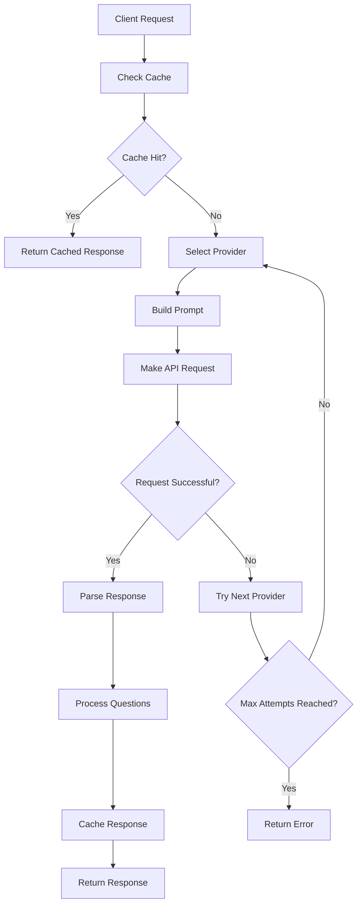
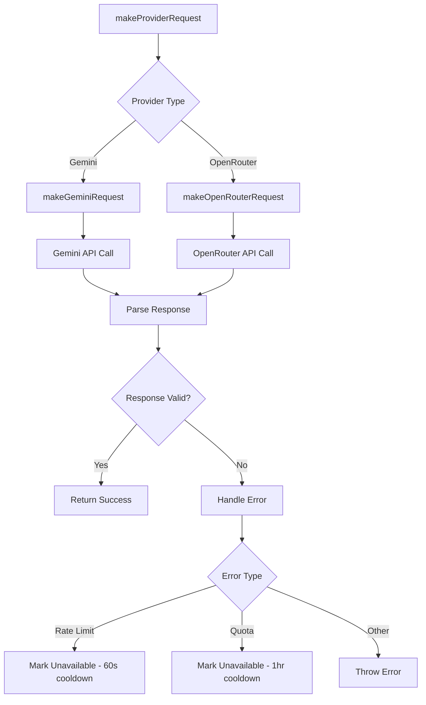
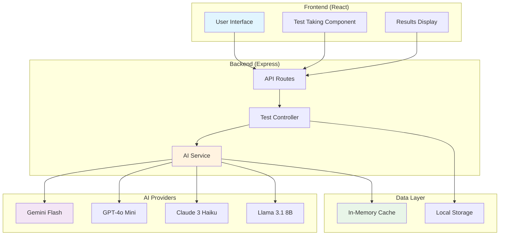
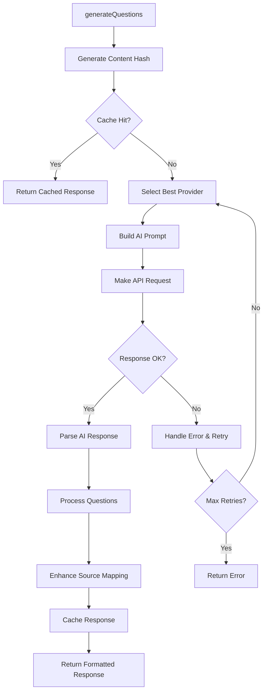

# StudyWise AI Backend Documentation

**Date:** September 12, 2025  
**Version:** 1.0.0  
**Author:** AI Assistant

---

## Table of Contents

1. [Project Overview](#project-overview)
2. [Project Structure](#project-structure)
3. [Architecture Flow](#architecture-flow)
4. [AI Service Deep Dive](#ai-service-deep-dive)
5. [API Endpoints](#api-endpoints)
6. [Data Flow Diagrams](#data-flow-diagrams)
7. [Configuration & Environment](#configuration--environment)
8. [Error Handling](#error-handling)
9. [Performance Optimization](#performance-optimization)

---

## Project Overview

**StudyWise AI** is an intelligent educational platform that transforms any text content into personalized learning materials using advanced AI technology. The backend serves as the AI-powered engine that generates questions, analyzes performance, and provides insights.

### Core Features

- 🤖 **Multi-Provider AI Integration**: Supports Google Gemini, OpenAI, Claude, and Meta Llama models
- 📝 **Intelligent Question Generation**: Creates multiple-choice, true/false, short-answer, and essay questions
- 📊 **Performance Analytics**: AI-powered insights and recommendations
- 💾 **Smart Caching**: Reduces API costs and improves response times
- 🔄 **Automatic Fallbacks**: Ensures reliability through provider redundancy
- 📈 **Cost Optimization**: Intelligent provider selection based on cost and performance

---

## Project Structure

```
server/
├── index.ts                 # Main server entry point
├── config.ts               # Environment configuration
├── routes.ts               # API route definitions
├── storage.ts              # Data storage layer
├── vite.ts                 # Development server utilities
├── controllers/
│   └── TestController.ts   # Request handlers
└── services/
    └── AIService.ts        # Core AI functionality
```

### File Responsibilities

| File | Purpose | Key Functions |
|------|---------|---------------|
| `index.ts` | Server bootstrap | Express setup, middleware, routing |
| `config.ts` | Environment management | API key loading, validation |
| `routes.ts` | API endpoints | Route definitions, middleware |
| `storage.ts` | Data persistence | User management, in-memory storage |
| `AIService.ts` | AI orchestration | Multi-provider management, caching |
| `TestController.ts` | Business logic | Request processing, response formatting |

---

## Architecture Flow

### High-Level Architecture

```
┌─────────────────┐    ┌─────────────────┐    ┌─────────────────┐
│   Frontend      │────│   Backend API   │────│   AI Providers  │
│   (React)       │    │   (Express)     │    │   (Gemini, etc) │
└─────────────────┘    └─────────────────┘    └─────────────────┘
         │                       │                       │
         └───────────────────────┼───────────────────────┘
                                 │
                    ┌─────────────────┐
                    │   Database      │
                    │   (Future)      │
                    └─────────────────┘
```

### Request Flow

1. **Client Request** → Frontend makes API call
2. **Route Matching** → Express router directs to controller
3. **Controller Processing** → TestController handles business logic
4. **AI Service Call** → AIService orchestrates AI providers
5. **Provider Selection** → Smart selection based on availability/cost
6. **API Call** → Request sent to selected AI provider
7. **Response Processing** → Parse and format AI response
8. **Caching** → Store result for future use
9. **Client Response** → Return formatted data to frontend

---

## AI Service Deep Dive

The `AIService.ts` is the heart of the backend, implementing a sophisticated multi-provider AI orchestration system.

### Core Components

#### 1. MultiProviderAIService Class

```typescript
class MultiProviderAIService {
  private providers: Map<string, AIProvider> = new Map();
  private geminiAI: GoogleGenerativeAI | null = null;
  private cache = new Map<string, { data: AIResponse; timestamp: number; expiresAt: number }>();
}
```

**Key Responsibilities:**
- Provider management and initialization
- Request routing and load balancing
- Response caching and optimization
- Error handling and fallback mechanisms

#### 2. Provider Configuration

Each AI provider is configured with specific parameters:

```typescript
interface AIProvider {
  name: string;                    // Display name
  available: boolean;              // Current availability status
  requestCount: number;            // Current request count
  lastReset: number;               // Last rate limit reset
  maxRequests: number;             // Rate limit per interval
  resetInterval: number;           // Reset interval in ms
  priority: number;                // Selection priority (lower = higher priority)
  costPerToken?: number;           // Cost per token for optimization
  maxTokens?: number;              // Maximum context length
}
```

### Supported Providers

| Provider | Model | Priority | Max Requests | Cost/Token | Context |
|----------|-------|----------|--------------|------------|---------|
| Gemini Flash | gemini-1.5-flash | 1 (Highest) | 15/min | $0.000125 | 1M tokens |
| GPT-4o Mini | gpt-4o-mini | 2 | 10/min | $0.00015 | 128K tokens |
| GPT-3.5 Turbo | gpt-3.5-turbo | 3 | 15/min | $0.0005 | 16K tokens |
| Gemini Pro | gemini-1.5-pro | 4 | 5/min | $0.00025 | 307K tokens |
| Claude 3 Haiku | claude-3-haiku | 5 | 8/min | $0.00025 | 200K tokens |
| Llama 3.1 8B | llama-3.1-8b | 6 (Lowest) | 12/min | $0.00005 | 131K tokens |

### Smart Provider Selection Algorithm

The system uses intelligent provider selection based on multiple factors:

#### Selection Criteria

1. **Availability Check**: Only consider providers that are currently available
2. **Rate Limit Check**: Ensure provider hasn't exceeded rate limits
3. **Content Size Check**: Verify provider can handle the content length (60% buffer)
4. **Request Size Optimization**:
   - Large requests (≥15 questions): Prioritize cost-effectiveness
   - Small requests (≤5 questions): Prioritize speed
   - Medium requests: Balance cost and speed

#### Selection Logic

```typescript
private getAvailableProvider(options?: GenerateQuestionsOptions): string | null {
  const contentLength = options?.content?.length || 0;

  const availableProviders = Array.from(this.providers.entries())
    .filter(([_, provider]) => {
      // Check availability and rate limits
      if (!provider.available || provider.requestCount >= provider.maxRequests) {
        return false;
      }

      // Check if provider can handle content size
      if (provider.maxTokens && contentLength > provider.maxTokens * 0.6) {
        return false;
      }

      return true;
    })
    .sort(([_, a], [__, b]) => {
      // Smart provider selection based on request size
      if (options && options.questionCount >= 15) {
        // Large requests: prioritize cost-effectiveness
        return (a.costPerToken || 0) - (b.costPerToken || 0);
      } else if (options && options.questionCount <= 5) {
        // Small requests: prioritize speed
        return a.priority - b.priority;
      } else {
        // Medium requests: balance priority and cost
        return a.priority - b.priority;
      }
    });

  return availableProviders.length > 0 ? availableProviders[0][0] : null;
}
```

### Request Processing Flow

#### 1. Question Generation Process



#### 2. API Request Flow



### Caching System

#### Cache Structure

```typescript
private cache = new Map<string, {
  data: AIResponse;
  timestamp: number;
  expiresAt: number;
}>();
```

#### Cache Key Generation

```typescript
private generateContentHash(options: GenerateQuestionsOptions): string {
  const hashInput = `${options.content.substring(0, 1000)}-${options.difficulty}-${options.questionCount}-${options.questionTypes.join(",")}`;
  return createHash("md5").update(hashInput).digest("hex");
}
```

#### Cache Benefits

- **Cost Reduction**: Avoids duplicate API calls
- **Performance**: Instant responses for repeated requests
- **Reliability**: Works even when AI providers are down
- **TTL Management**: 24-hour expiration with automatic cleanup

### Error Handling & Resilience

#### Error Types Handled

1. **Rate Limiting**: Automatic cooldown and provider switching
2. **Quota Exceeded**: Temporary provider disabling
3. **Network Errors**: Retry with different provider
4. **Invalid Responses**: Fallback to basic processing
5. **API Failures**: Graceful degradation

#### Fallback Mechanisms

```typescript
// Try up to 3 different providers
const maxAttempts = Math.min(3, this.providers.size);
for (let attempt = 0; attempt < maxAttempts; attempt++) {
  const providerId = this.getAvailableProvider(options);
  if (!providerId) {
    console.log("⏳ No suitable providers available, waiting 10 seconds...");
    await this.sleep(10000);
    continue;
  }

  try {
    // Attempt request with selected provider
    const response = await this.makeProviderRequest(providerId, prompt);
    // Process successful response
    return processedResponse;
  } catch (error) {
    // Log error and try next provider
    console.log(`❌ Provider ${providerId} failed, trying next...`);
    await this.sleep(2000); // Progressive delay
  }
}
```

---

## API Endpoints

### Question Generation

**Endpoint:** `POST /api/tests/generate`

**Request Body:**
```json
{
  "content": "Your study material text here...",
  "difficulty": "easy|medium|hard",
  "questionCount": 10,
  "questionTypes": ["multiple-choice", "true-false"],
  "subject": "Optional subject name",
  "focus": "Optional focus areas"
}
```

**Response:**
```json
{
  "questions": [
    {
      "id": "q1",
      "type": "multiple-choice",
      "question": "What is the capital of France?",
      "options": ["London", "Paris", "Berlin", "Madrid"],
      "correctAnswer": "Paris",
      "explanation": "Paris is the capital and largest city of France.",
      "difficulty": "easy",
      "points": 1,
      "sourceText": "Paris is the capital of France",
      "sourceOffset": 45,
      "sourceLength": 27,
      "confidence": 0.85
    }
  ],
  "metadata": {
    "totalQuestions": 10,
    "estimatedTime": 10,
    "difficulty": "easy",
    "subject": "Geography",
    "contentHash": "abc123..."
  }
}
```

### Test Results Submission

**Endpoint:** `POST /api/tests/:testId/results`

**Request Body:**
```json
{
  "score": 80,
  "totalQuestions": 10,
  "userAnswers": {
    "q1": "Paris",
    "q2": "True"
  },
  "correctAnswers": {
    "q1": "Paris",
    "q2": "False"
  }
}
```

### AI Insights Generation

**Endpoint:** `POST /api/tests/:testId/insights`

**Request Body:**
```json
{
  "score": 80,
  "totalQuestions": 10,
  "questions": [...],
  "userAnswers": {...},
  "correctAnswers": {...},
  "testTitle": "Geography Quiz",
  "sourceContent": "Full text content..."
}
```

**Response:**
```json
{
  "overallPerformance": "Good performance with solid understanding",
  "strengths": [
    "Strong grasp of basic geography concepts",
    "Accurate answers on capital cities"
  ],
  "weaknesses": [
    "Some confusion with European geography",
    "Need to review country borders"
  ],
  "studyRecommendations": [
    "Review European geography maps",
    "Practice with interactive quizzes",
    "Focus on memorizing country capitals"
  ],
  "focusAreas": [
    "European countries and capitals",
    "World geography basics"
  ]
}
```

---

## Data Flow Diagrams

### Complete System Flow



### AI Service Internal Flow



---

## Configuration & Environment

### Environment Variables

| Variable | Purpose | Required | Example |
|----------|---------|----------|---------|
| `GEMINI_API_KEY` | Google Gemini API key | Yes | `AIzaSy...` |
| `OPENROUTER_API_KEY` | OpenRouter API key | Yes | `sk-or-v1-...` |
| `NODE_ENV` | Environment mode | No | `development` |
| `PORT` | Server port | No | `5000` |
| `SITE_URL` | Site URL for OpenRouter | No | `http://localhost:3000` |
| `APP_NAME` | App name for OpenRouter | No | `AI Test Generator` |

### Provider Rate Limits

| Provider | Requests/Minute | Token Limit | Cost/Token |
|----------|-----------------|-------------|------------|
| Gemini Flash | 15 | 1M | $0.000125 |
| GPT-4o Mini | 10 | 128K | $0.00015 |
| GPT-3.5 Turbo | 15 | 16K | $0.0005 |
| Gemini Pro | 5 | 307K | $0.00025 |
| Claude 3 Haiku | 8 | 200K | $0.00025 |
| Llama 3.1 8B | 12 | 131K | $0.00005 |

---

## Error Handling

### Error Types & Responses

#### 1. Provider Unavailable
```json
{
  "error": "Question generation failed: All providers exhausted",
  "details": "Rate limit exceeded on all available providers"
}
```

#### 2. Invalid Request
```json
{
  "error": "Missing required parameters",
  "details": "content, difficulty, and questionCount are required"
}
```

#### 3. AI Response Error
```json
{
  "error": "Failed to generate insights",
  "details": "Invalid JSON response from AI"
}
```

### Graceful Degradation

1. **Cache Fallback**: Serve cached responses when providers are down
2. **Basic Insights**: Provide rule-based insights when AI fails
3. **Provider Switching**: Automatically switch to available providers
4. **Progressive Delays**: Increase delays between retry attempts

---

## Performance Optimization

### Caching Strategy

- **TTL**: 24 hours for question responses
- **Key Generation**: MD5 hash of content + parameters
- **Automatic Cleanup**: Hourly cleanup of expired entries
- **Memory Management**: Efficient Map-based storage

### Cost Optimization

- **Smart Selection**: Choose cheapest provider for large requests
- **Caching**: Avoid duplicate API calls
- **Content Optimization**: Truncate content to reduce token usage
- **Rate Limit Management**: Distribute load across providers

### Response Time Optimization

- **Parallel Processing**: Handle multiple requests concurrently
- **Provider Prioritization**: Use fastest providers for small requests
- **Content Chunking**: Process large content in optimal sizes
- **Connection Pooling**: Reuse HTTP connections

---

## Monitoring & Debugging

### Logging Levels

- **INFO**: Successful operations, provider selection
- **WARN**: Rate limits, temporary failures
- **ERROR**: API failures, parsing errors
- **DEBUG**: Detailed request/response data

### Health Check Endpoint

**Endpoint:** `GET /health`

**Response:**
```json
{
  "status": "ok",
  "timestamp": "2025-09-12T14:47:33.639Z",
  "providers": {
    "gemini-flash": true,
    "gpt-4o-mini": true,
    "claude-3-haiku": false
  }
}
```

### Provider Status Monitoring

```typescript
// Get real-time provider status
const status = aiService.getProviderStatus();
console.log(status);
// Output: {
//   "gemini-flash": {
//     "name": "Gemini Flash",
//     "available": true,
//     "requestsUsed": 3,
//     "maxRequests": 15,
//     "priority": 1,
//     "costPerToken": 0.000125,
//     "maxTokens": 1000000
//   }
// }
```

---

## Future Enhancements

### Planned Features

1. **Database Integration**: Replace in-memory storage with PostgreSQL
2. **User Authentication**: Implement proper user management
3. **Advanced Analytics**: Detailed performance tracking
4. **Custom Models**: Fine-tuned models for specific subjects
5. **Batch Processing**: Handle multiple requests efficiently
6. **Real-time Collaboration**: Multi-user test creation

### Scalability Improvements

1. **Redis Caching**: Distributed caching for multiple instances
2. **Load Balancing**: Horizontal scaling across multiple servers
3. **Queue System**: Asynchronous processing for large requests
4. **CDN Integration**: Faster content delivery
5. **Monitoring Dashboard**: Real-time system metrics

---

## Conclusion

The StudyWise AI backend represents a sophisticated AI orchestration platform that intelligently manages multiple AI providers to deliver reliable, cost-effective, and high-performance educational content generation. The multi-provider architecture ensures resilience, while the intelligent caching and optimization systems maximize efficiency and user experience.

**Key Strengths:**
- ✅ Robust multi-provider AI integration
- ✅ Intelligent provider selection and failover
- ✅ Comprehensive caching and optimization
- ✅ Detailed error handling and monitoring
- ✅ Cost-effective operation
- ✅ Scalable architecture

This documentation provides a comprehensive understanding of the backend system, enabling developers to effectively maintain, extend, and optimize the platform.